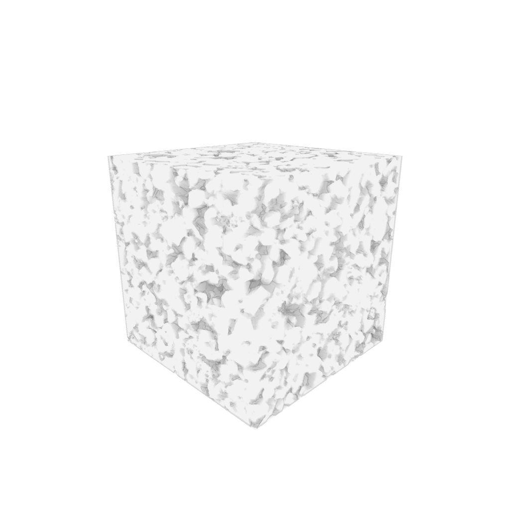
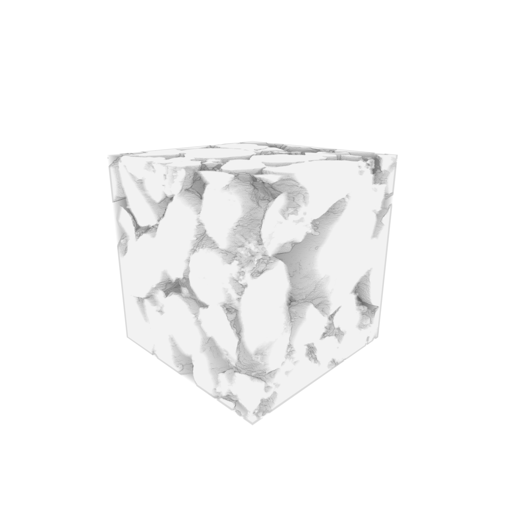

# rock-renderer

The Treachery of Images - *René Magritte*

<table>
<tbody>
<tr>
<td></td>
<td></td>
<td></td>
<td></td>
</tr>
</tbody>
</table>

The images came from the Pore Scale Modelling group of Imperial College London and were originally introduced in *Dong and Blunt, 2009*, DOI: http://dx.doi.org/10.1103/PhysRevE.80.036307.
