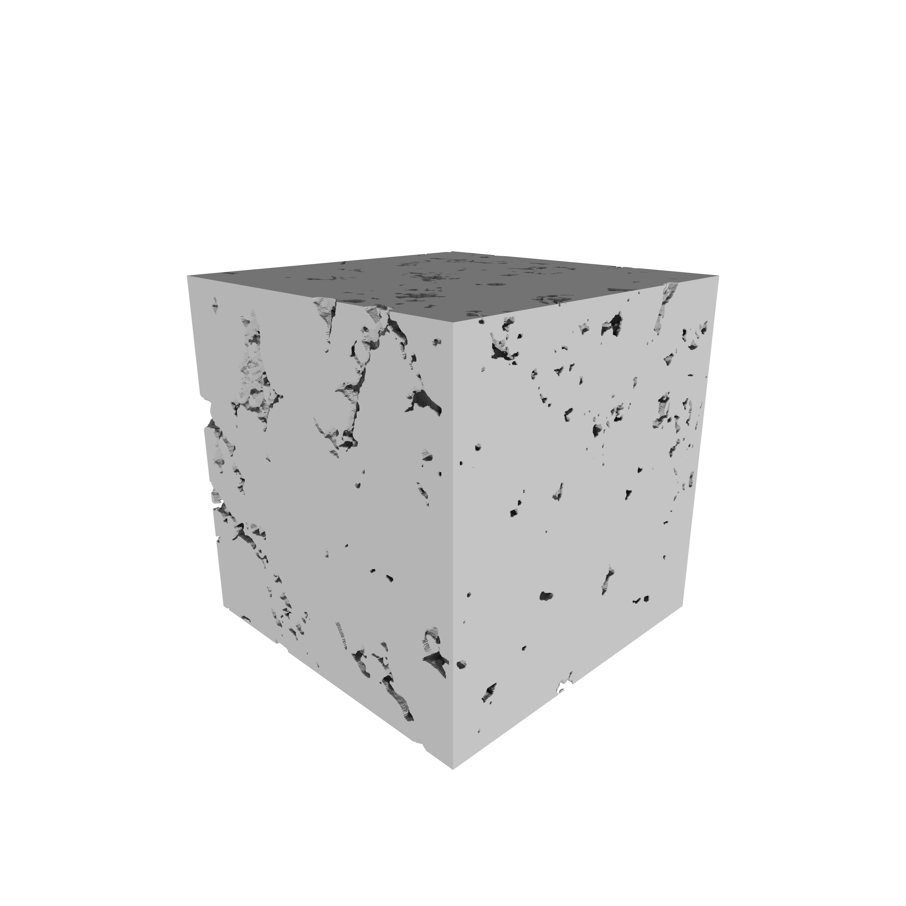

# rock-renderer

This repository is a *really* early experimentation with [OSPRay](https://www.ospray.org/) to render pore scale images. I haven't use any of the important features present in the OSPRay framework. I hardly think that large rock images (*e.g.* ~1000 voxels in each dimension) would work without trying greedy voxel merging algorithms. 

<table>
<tbody>
<tr>
    <td></td>
    <td></td>
</tr>
<tr>
    <td style="text-align:center">solid phase</td>
    <td style="text-align:center">pore space</td>
</tr>
<tr>
    <td style="text-align:center" colspan="2">Those images were kindly made available by Dr. Bagus P. Muljadi in the [Digital Rock Portal][1] and were part of the published work in [Muljadi et al (2015)][2].</td>
</tr>
</tbody>
</table>

[1]: http://www.digitalrocksportal.org/projects/10 "Bagus Putra Muljadi. Estaillades Carbonate. Digital Rocks Portal (September 2015)."
[2]: http://dx.doi.org/10.1016/j.advwatres.2015.05.019 "Bagus P. Muljadi, Martin J. Blunt, Ali Q. Raeini, Branko Bijeljic. The impact of porous media heterogeneity on non-Darcy flow behaviour from pore-scale simulation. Advances in Water Resources. 2015."
